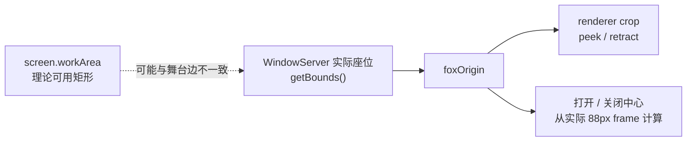
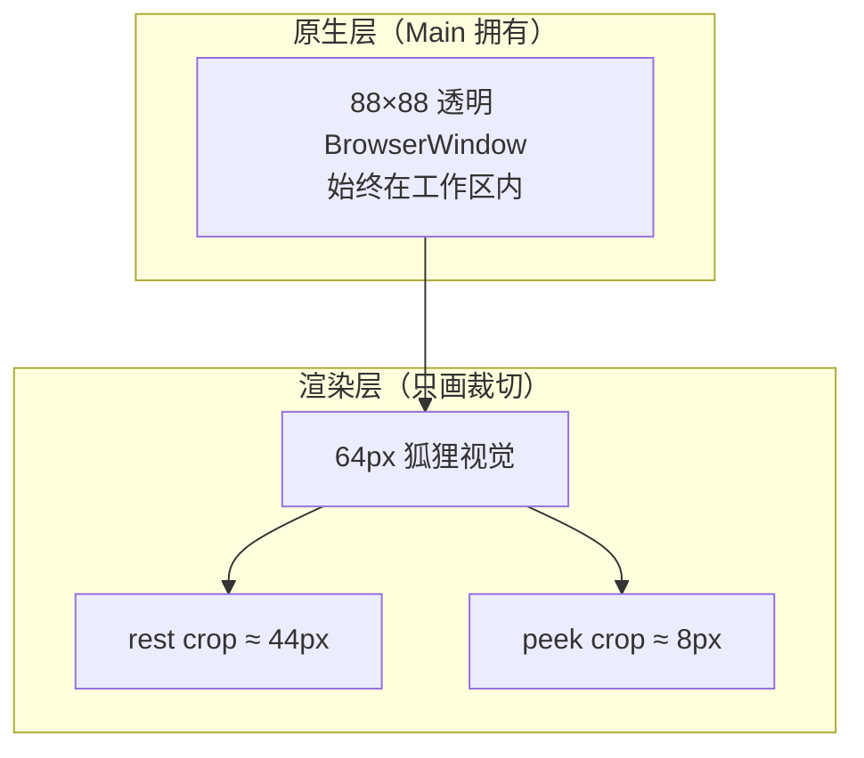
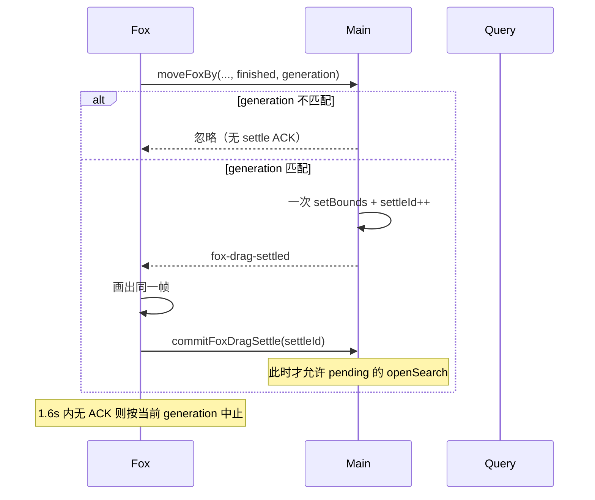
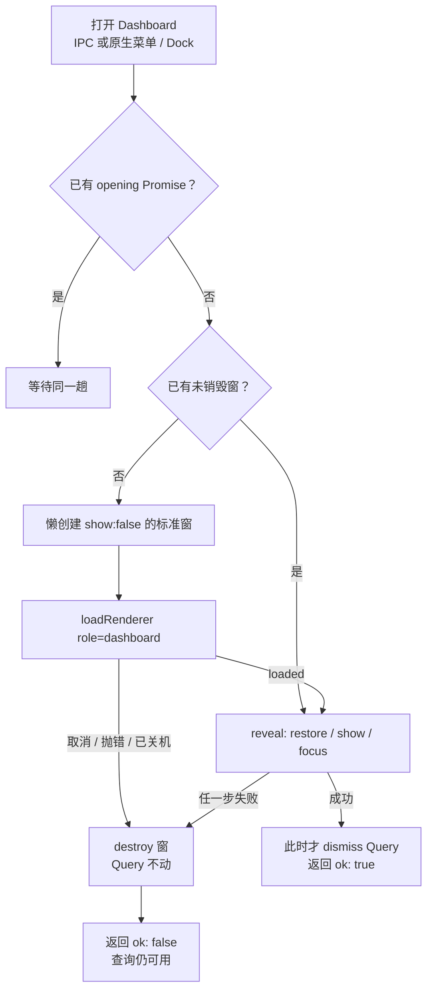
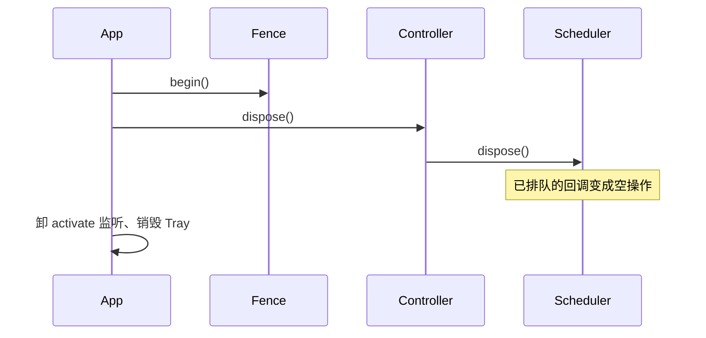
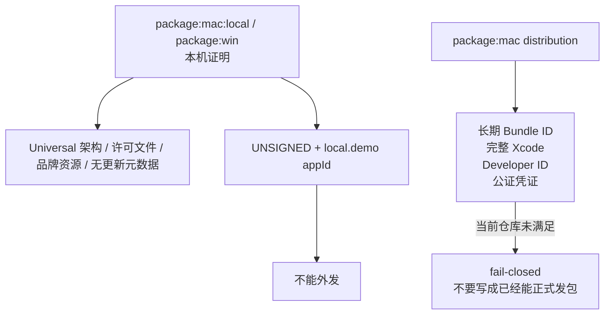

# 为什么桌面 Demo 把「失败」设计成可退回

本页解释几个看起来别扭的实现选择：为什么 Main 宁可信 WindowServer 的实际坐标，也不反复去抢理论 x=0；为什么 88px 的原生窗不能跟着探头一起缩小；为什么打开 Dashboard 成功之前绝不能收起查询。它不承诺真实 OS 焦点或真实台前调度已被自动化证明。

相关文档：[第一次运行](tutorial-first-run.md) · [如何验证](how-to-verify-desktop.md) · [桌面合同](reference-desktop-contracts.md)

---

## 1. 问题：理论 workArea 和用户看见的边不是一回事

Electron 的 `screen.workArea` 描述的是「这台显示器扣掉 Dock / 菜单栏后的矩形」。macOS 台前调度（Stage Manager）还可以再给后台 App 一条**舞台边**，这条边常常不出现在 `workArea` 里。

若 Main 在每次 hover 探头时都执行「把狐狸 `setBounds` 到 `workArea.x`（物理屏 x=0）」，后台透明窗会被 WindowServer 立刻弹回舞台边。下一帧 hover 又请求 x=0，于是出现 `left ↔ none` 和 x0 往返横跳。用户看见的是狐狸在边缘抽搐，而不是稳定半露。

所以本 Demo 把 **WindowServer 实际接受的 `BrowserWindow.getBounds()`** 当作该 dock epoch 的位置真值：

`move` / `moved` 只回读，不补偿。`setFoxPeek` 在 hover 上不再请求理论 x=0。交付标准是：**停在系统接受的边上，不横跳**。这不等于「已经占住物理屏最左边」，也不等于「真实 Stage Manager 场景已被 E2E 证明」。`@float` 里有一条 harness 模拟舞台边的用例，它验证的是「代码会采纳 actual bounds」，不是用户打开台前调度后的完整 OS 行为。

---

## 2. 问题：探头如果去改原生窗，会和 WindowServer 打架

狐狸视觉是 64px，原生窗固定 88px，多出来的是动效与裁切留白。贴边时若把透明窗推出屏外，或每帧 `setBounds` 做动画，macOS 会把窗拽回工作区，动画与系统约束对打。

因此原生 frame 始终完整留在工作区（贴边时 margin 为 0）。半露 / 探头只改 renderer 裁切：

| 视觉目标 | 原生窗 | renderer |
| --- | --- | --- |
| 稳定半露，64px 狐狸各露 32px | 仍是 88×88，整窗在工作区内 | 等效裁掉约 44px |
| 悬停探头到约 80px 可见 | 仍不改 native bounds | 420ms 镜像 crop |
| 离开缩回 | 仍不改 native bounds | 300ms 反向 crop |

禁止动画负责裁切的 `.fox-idle` 根节点，也禁止用循环原生 `setBounds` 冒充探头。真实 OS 命中测试（尤其折叠 Dashboard 侧栏）仍要用鼠标，CDP click 不算。

---

## 3. 问题：拖拽、探头、打开查询会互相踩时间

一次松手、一次 hover、一次快捷键可能重叠。如果「最新一次 IPC 赢」，旧的 settle ACK 会盖住新 drag，或在拖到一半时打开错位的 Query。

本 Demo 用三代序号把时间拆开：

| 序号 | 谁加 | 挡住什么 |
| --- | --- | --- |
| `generation` | Fox 每次主键按下 +1 | 过期的 move / finished；旧 watchdog |
| `settleId` | Main 每次成功松手 settle +1 | 较小的 ACK；未提交的打开 Query |
| `epoch` | Main 每次改 dock 边 / 重置 peek +1 | 过期的 peek / retract |
| layout `sequence` | Query 每次上报 +1 | 过期的高度 ACK |
| `handoffId` | Main 每次交接 +1 | 过期的 open-armed / close-finished |

打开查询本身也是两阶段：隐藏 Query 先 `open-armed`，Main 才换窗；关闭等 `close-finished`。定时器只兜底，正常完成看回执。自动化可以证明状态机与 harness 下的窗口可见性，**不能**证明用户点程序坞后系统一定把键盘焦点交给输入框。

---

## 4. 问题：Dashboard 加载失败时，查询绝不能先消失

若先 `dismiss()` 再 `loadURL`，加载失败会留下「查询没了、工作台也没开」的空桌面。对坐席来说这比打不开更糟。

所以 reveal 是原子的，而且 single-flight：

Query 走 IPC 时，失败文案留在查询窗。Tray / 菜单 / Dock 再加一个原生警告框：「运营工作台未打开」，狐狸头和查询继续工作。重复点击不会并行创建两个 Dashboard，只会加入同一趟 Promise。

这仍然不证明「点程序坞后 macOS 一定把应用激活」——那是真实设备门禁。

---

## 5. 问题：退出途中的定时器不能再改窗

`before-quit` / `will-quit` 会先 `shutdownFence.begin()`，再拆 Desktop shell、`controller.dispose()`。之后任何 `isInactive()` 为真的路径直接返回。

`GuardedScheduler` 在 dispose 时清掉所有 `setTimeout`，并且回调开头再查 `disposed`。否则可能出现：handoff 兜底定时器在窗已毁后 `setBounds`，或 identity 协程在关机后还去 `dock.show()`。

`applyApplicationIdentity` 在设 Dock 图标 / `dock.show()` 前后都会看 fence。二次启动若落在 ready 之前只记 pending，不会对着半初始化的 controller 抢焦点。

---

## 6. 问题：本机证明包为什么不能外发

`pnpm package:mac:local` / `pnpm package:win` 的目标是：**在开发机上证明构建图能跑通**，不是证明「可以寄给别人」。

原因叠在一起：

1. 产物文件名强制 `UNSIGNED`；本地 mac 后验要求 `codesign --verify` **失败**。
2. `appId` 仍是 `local.demo.customer-agent`。`pnpm package:mac` 在检查到 `local.` / `.demo.` 时直接失败，避免静默打出看起来像正式包的东西。
3. 未签名包经浏览器 / 网盘下载后，Gatekeeper 通常直接拦截。这不是文案问题，是系统策略。
4. Windows 后验只比文件树、`UNSIGNED` 后缀、`icon.ico` 字节和许可文件；它不看 PE 图标资源，也不看 Authenticode。
5. `THIRD_PARTY_NOTICES.md` 只覆盖 Electron / Chromium / React，**不**构成本 Demo 的分发授权。
6. 包内关闭自动更新元数据，避免被当成可升级产品。

把本地 DMG 发给外包或客户，等于把「未签名 + Demo 身份」伪装成产品。需要外发时，必须另走公司 Bundle ID、证书和公证，且与本任务包的 Git 授权分开。

---

## 7. 读完可以记住的边界

- 位置真值是 actual bounds，不是理论 x=0。
- 88px 是原生 frame；探头是 crop。
- 序号（generation / epoch / sequence / settleId / handoffId）让旧回执失效。
- Dashboard 先亮出来再收查询；失败则查询不动。
- shutdown fence 让退出后的定时器闭嘴。
- 本地证明包证明构建，不证明分发。
- 上述任何一条的自动化绿，都不等于真实 OS 焦点或真实 Stage Manager 已经验收。
