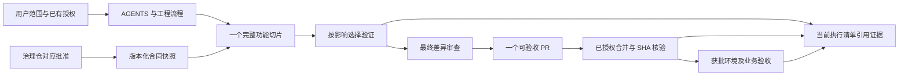

# 客服 Agent 工程治理盘查与根因整改方案

> 审计日期：2026-09-06。状态：REVIEWED · 盘查与整改建议；本报告不新增正式能力、真实运行或 Git 发布授权。
> 阅读说明：第1～9节保存首次盘查时的证据和整改目标；用户随后已授权实施，实施设计与验证补记见第10节。具体当前步骤只维护在执行清单，不把本报告当作第二份动态状态台账。
> 产品源码基线：`ca6a062f577b9a430ec7b86b523105fa0aeec7e6`，位于 `customer-agent-case-report` 的干净工作区。主工作区仍在 `bb1925e`，有先前未提交的规则、流程和计划，审计期间保留。以下区分 main 的现状与主工作区刚调整的执行规则。

## 1. 结论

产品的模块隔离、真实数据边界、不可变合同与设备验收要求合理，应保留。执行体系存在三个优先修复的问题：**报告交付链缺少统一验收、测试选择与 CI 路由不一致、当前状态散落在多份历史文档中**。这些问题造成返工和反复确认；仅删除 hook 或缩短 AGENTS.md 无法根治。

本仓没有堆叠多个 Git 测试 hook：只有一个有效 `pre-push`，负责新增内容的凭证扫描。全局 Codex/Claude hook 和配置备份确实存在，但必须按宿主和触发条件分开看。现有证据不足以把它们认定为本任务数小时耗时的主因。

还有执行者自身的问题：此前把候选、装载、运行、报告和可复核结果分段验证，直到真实补证后才发现合法失败码、分层和逐题字段的缺口；多次状态不变仍做相似回读。这不是安全门强制要求的成本，必须改变我的执行方法。

## 2. 本仓治理逻辑及实际执行入口

| 层 | 所有者与入口 | 应解决的问题 | 本次判断 |
| --- | --- | --- | --- |
| 用户范围与授权 | 当前任务明确指令；正式动作对应批准记录 | 本次做什么，哪些动作已获授权，缺项只阻塞什么 | 保留；一次明确批准可覆盖同一候选多个动作，不能机械拆成多轮 |
| 稳定执行纪律 | `AGENTS.md` | 信任边界、设计纪律、测试范围选择、Git 权限 | 总体合理；本地已增加持续执行规则，main 尚未收到本批修改 |
| 工程流程 | `docs/reference-engineering-workflow.md` | 范围→实施→验证→审查→PR→合并→环境验收 | 本地已固定；需要接上实际测试入口和证据复用，不能只再加文字 |
| 身份及生命周期 | `PROJECT_CHARTER.md` | 产品实施仓身份、双仓关系、长期阶段边界 | 合理；页头又复制动态状态，已发生过时 |
| 正式范围及机器合同 | 治理仓当前批准；产品仓版本化快照 | 批准能力、OpenAPI/DDL 双哈希、不可变来源 | 保留；不引入跨仓运行时依赖，不用产品测试替代批准 |
| 实施和模块归属 | 获批计划、架构参考、源码 | 哪个模块拥有状态、校验、输出和失败恢复 | 桌面/API/contracts/database 分界合理；离线报告消费者的职责仍分散 |
| 验证 | package scripts、CI、专项计划 | 确切版本在什么环境下证明什么 | 本地专项、默认测试和 CI 之间有漏接和重复 |
| 产品及设备验收 | DESIGN、DEVELOPMENT_BRIEF、设备/业务证据 | 合成交互、真实系统行为和业务通过分别成立 | 保留；Windows hosted smoke 不能替代企业设备验收 |
| 历史及交接 | plans、CHANGELOG、已有执行清单、不可变证据 | 历史可追溯，恢复时能找到当前动作 | 历史与当前混排，导致状态回填和恢复成本放大 |
| 工具及宿主 hook | Git hook、Codex hooks、Claude hooks、Grok 生命周期 | 凭证保护、桌宠状态、权限 UI、任务进程回收 | 不拥有业务阶段或测试通过结论；需按来源管理，不能统一当成仓库门禁 |



正式范围、真实输入或运行批准缺失时，只阻塞对应分支。合成工程、报告可用性和材料准备可以独立推进。流程本身不把所有准备活动串行化。

## 3. 测试体系：有扎实基础，但入口与目标不匹配

### 3.1 应保留的部分

- Node 24 与锁定 pnpm；依赖齐全且锁文件未变时不重复安装。
- unit/component、PG15 集成、Electron E2E、打包后验和人工设备验收分层，不能用任何单层“全绿”代替其他层。
- PG15 使用独占临时 cluster 和 Unix socket；报告、正常退出和异常回收分别保留证据。
- 正式候选产物绑定 clean checkout、提交 SHA 和文件哈希，禁止旧 dist 冒充新候选。不能为了满足此门而自动提交未审查工作。

### 3.2 已证实的问题

| 优先级 | 问题及证据 | 影响 | 根因处理 |
| --- | --- | --- | --- |
| P1 | `.github/workflows/ci.yml:60–61` 只执行 database integration 和 API `test:integration`；`apps/api/package.json:22` 的 API integration 只列四个旧套件。E0 PG 集由 `g1a-e0-synthetic.integration.test.ts:20–22` 的独立开关控制 | CI 三路绿色仍未运行 E0 的真实 PG 专项；输入、owner 装载和离线评测主链可绕过该层回归 | 把纯合成 E0 专项接入 CI，保留真实包开关关闭；增加可见的执行数量，零用例/跳过不能当专项 PASS |
| P1 | v4 消费者位于仓外，读取 TypeScript 源码的 union 来推导失败码；投影又独立维护枚举、分层和逐题一致性 | 类型定义、生产者和消费者变化需多处同步；前面三次真实补证暴露报告字段遗漏 | 建立一个明确版本的报告交付合同，通用序列化/脱敏验证由一个所有者维护，外层只拥有授权、沙箱、执行、保存及恢复 |
| P2 | `docs/how-to-verify-desktop.md:253` 的文档任务建议仍列 lint/typecheck/test/build，和 AGENTS 第 6 节的文档分级核验冲突 | Agent 可能为纯文档反复跑全套 | 测试选择只留一份生效规则；指南改为命令及证明边界参考，移除历史“本轮”建议 |
| P2 | CI 对 pull_request 和 main push 全量触发，没有按变化范围区分 lane | 单个状态文档修改也跑 PG 和 Windows 打包 | 先补漏测，再做路径影响路由；保留总门稳定状态和未知范围回退全量，先核实 branch protection 后实施 |
| P2 | root `test` 会构建 contracts/database；之后 `build` 又通过两包 `test:package` 重新编译并 smoke；`artifact:m0:build` 还调用 root build。Windows smoke 先 build，随后 package 再构建 | 验证与构建职责交叉，同一次交付重复执行依赖编译和包检查 | 梳理一次构建的依赖顺序；检查已有产物需要有内容/输入绑定，不能直接删除构建前置或信任旧产物 |
| P2 | 同一指南的全量命令先 `pnpm build`，随后 `pnpm test:e2e` 自带 build；安装包示例仍写 `0.2.0`，实际 desktop 为 `0.2.1` | 重复构建，运行说明会误导版本核验 | 示例使用版本占位或从唯一版本源派生；全量路径明确哪个步骤拥有 build |

这里的 P1 表示应优先修复的工程缺口，不代表已经造成生产事故。真实包 runner 被默认跳过是正确的安全边界；漏接的是可以自动运行的**纯合成**专项。

### 3.3 目标验证路由

以下是整改目标，不是另一份长期测试矩阵。实施时应把机器选择规则落实到现有 package scripts / CI，文字只引用其入口。

| 变化 | 本地开发反馈 | PR / 合并验收 |
| --- | --- | --- |
| 普通文档、注释、状态引用 | diff、链接、引用及语义一致性 | 轻量文档总门；不跑安装包 |
| AGENTS、执行规则、测试/CI 文档 | 上述检查，另核对实际脚本、优先级和权限语义 | 对应规则一致性检查；不当作普通文字无条件跳过 |
| API 局部纯逻辑 | 受影响 unit、lint/typecheck | API 相关检查；公共边界变化扩展 |
| E0 loader、评测、报告 | 输入/评测 unit + 实际 PG15 + 下游报告消费 | 必跑纯合成 E0 集成，不启用真实输入选择器 |
| DB / 合同 / 公共权限 | 生成物及不变性、全部受影响 consumers、PG15 | 保留完整相关门禁及候选产物验证 |
| 桌面行为 / 原生窗口 | component/unit、适用 float/E2E | 桌面与目标平台验证，设备项单列 |
| 依赖 / 构建 / 发布输入 / 无法可靠分类 | 扩大到相关全量 | 全量回退；未知文件不能被默默判为 docs-only |

不直接采用“所有 PR 永久跳过 Windows”或“只跑改动文件自己的测试”。前者移除平台证据，后者遗漏调用方和共享依赖。

## 4. 文档体系：需要消除多份当前状态

main 基线有 **41 个已跟踪 Markdown 文件，合计 6,097 行、569,335 字节**。数量本身不构成缺陷；问题是同一阶段在不同文档中以“当前”重复出现。

| 位置 | 核对到的状态 | 判断 |
| --- | --- | --- |
| `PROJECT_CHARTER.md:8` | 仍写负责人承接机器合同未转换、T4 blocked、T5 未评测 | 已过时；#29～#31 已合并，当前执行记录已有第三次真实运行 |
| G1a 实施计划页头、第 6 节与末尾 | “当前”基线仍停在 #26，等待合同转换 | 同样过时；不是重新要求业务审批的依据 |
| DEV-M1 计划页头 | 保留 W4 的 main SHA 和 runner 开发分支 | 应明确为历史切片快照，避免当成当前分支 |
| owner-contract-consumption 计划页头 | `LOCAL VALIDATED · PR HANDOFF PENDING` | #29 已合并；标题未标明记录时点 |
| productization 长计划 | 1,479 行；页首有状态续记，但正文保留旧授权语境 | 历史设计可以保留；日常不应重读全部以确定当前授权 |
| 当前执行清单 | 已在主工作区分为已完成、可执行、待人工决定、依赖未满足 | 方向正确，但本地未提交，其他 worktree/main 不会自动获得这些调整 |

根因是**把“留下历史证据”实现为“在多个入口追加当前状态”**。每次 merge 又写回多处，产生新的文档 PR；新 PR 自己合并后又需要更新 SHA。这个循环没有天然终点。

整改方式：

1. `PROJECT_CHARTER` 保留身份、生命周期与当前状态入口；删除其对实时 T4/T5 等数值和下一动作的复制，历史事实仍可链接追溯。
2. 一个任务只维护已有的当前执行清单；计划保存批准范围和设计，旧实施记录明确写“截至某版本的历史记录”。治理仓仍拥有正式状态和批准真源。
3. 功能说明与该功能一起进入 PR。合并后的精确 SHA / CI 以 GitHub 和既有交付证据为事实来源，只有确有状态交接需要时更新清单，不为每个 SHA 再开一轮同步文档 PR。
4. 日常恢复只读入口与当前步骤；查设计争议时才沿链接读相关历史。保留历史，不删除批准和失败证据。
5. 本地流程调整以独立文档变更交付，保留已有脏文件；不能声称 main 已生效或用强制 reset 同步工作区。

## 5. Hook 配置盘查

| 层 / 路径 | 当前配置 | 触发与实际工作 | 是否已证明拖慢本任务 |
| --- | --- | --- | --- |
| 产品仓 `.git/hooks/pre-push` | 1 个有效 Git hook；无自定义 hooksPath，无 `pre-push.local` | push 时调用 gstack-redact，扫描新增内容中的高风险凭证；不跑 pnpm 测试 | 没有；普通读取、编辑和测试不会触发它。保留 |
| `.git/hooks/*.sample` | 历史示例文件 | `.sample` 名称不会作为 Git hook 执行 | 不会因存在而执行，不是优先清理对象 |
| 仓内 `.claude/.codex/.agents/.husky/.githooks` | 主工作区不存在这些配置目录 | 没有这几层额外仓级注册 | 未发现叠加 |
| `~/.codex/hooks.json` | Clawd 的 6 类事件；Codex features.hooks=true，存在对应信任记录 | SessionStart、UserPromptSubmit、PreToolUse、PostToolUse、Stop 上报本地状态；PermissionRequest 走权限 UI | 确实注册，逐次实际生效和耗时还不能仅凭配置证明 |
| Codex Clawd 稳定 launcher | node@24 → Clawd.app 的 `codex-hook.js` | 状态请求代码 timeout=100ms；SessionStart 自动启动路径最多 10s；权限请求最多 590s，宿主配置600s | timeout 是上限，不是每次消耗。不能乘以工具次数估算延迟 |
| Grok Build 插件 0.2.2 | 插件已启用；SessionStart / SessionEnd 各一个5s hook | launcher/env 准备及本会话遗留任务回收 | 不是每次工具调用都跑，也不是 gstack 测试门 |
| `~/.claude/settings.json` | 15 类事件、17 个条目；15 个 async，权限 HTTP 和 gstack Stop 为非 async | Clawd 状态、权限 UI 和 gstack timeline | Claude 宿主配置不能算作 Codex 的重复执行 |
| `~/.claude/settings*.bak*` | 8 个备份 | 未发现 active settings 引用这些备份 | 不会因为备份多而执行多次；本轮不删除 |
| gstack skill 路径 | Codex 独立 skill 链接指向同一 `.gstack/repos/gstack`；兼容目录中的 bin 也解析到同一源 | 多个入口路径不等于多个运行副本 | helper 哈希相同，未发现该处重复执行版本 |

当前 gstack 显式配置包括 `telemetry: off`、`cross_project_learnings: false`、`redact_prepush_hook: true`、`proactive: true`。`proactive` 不能覆盖仓库规定的按需 Skill 路由；审计也不运行引导、配置写回或同步脚本。

### 耗时证据及限制

- 读取本日 Codex app 日志后，`hook` 匹配项中的一部分只是 Git 命令里的 `core.hooksPath`，不是 hook 执行记录，已排除。
- 其余可配对的 app 通知样本为 **437 对**，开始/完成通知间隔中位数 **64ms**、P95 **121ms**、最大 **378ms**。这些来自标记为 unknown conversation 的日志，**当前主任务匹配记录为 0**；只能证明该样本未显示长时间 hook 等待，不能外推为本任务的完整 hook profile。
- 安全微测不发送 HTTP、不弹权限、不启动 Clawd，也不解析真实对话。注入空进程解析器后，状态对象构建约 **0.07–0.08ms 中位数**；5 次 Node 子进程启动、加载模块并各构建100次的总耗时中位数 **38.2ms**。不包含真实进程识别、网络等待、权限交互，不能当作 native hook 总耗时。
- 日志有 `Received hook/... for unknown conversation` 的宿主路由异常，需作为独立宿主问题记录；没有证据表明它使本任务等待数分钟或阻塞测试。不要为了消除日志而改变项目测试与业务安全门。

处理原则：先明确每条 hook 的唯一所有者、宿主、事件和用途，再针对可观测慢路径做同环境前后对比。只有确认某个状态展示 hook 重复或不再需要，才考虑收敛其高频触发；权限 hook 与凭证扫描不得随之整体关掉。全局 hook 属于 Clawd / Grok / Codex 配置，直接改生成文件还可能被下次启动覆盖，整改应回到安装或配置所有者。

## 6. 慢在哪里：证据与归因

| 观察 | 实际数据 / 证据 | 可以得出的结论 |
| --- | --- | --- |
| CI 基础耗时 | 最近40个可见 CI run，中位数239.5秒，范围210–312秒，39成功/1失败。时间为 GitHub run 起止包络，含队列/收尾 | 单次约4分钟；不能将相互重叠的 run 相加当成用户等待时间 |
| #33 合并 CI | Windows 232秒，其中 package 168秒；Linux156秒，其中 pnpm check134秒；PG68秒，其中PG安装15秒、DB17秒、API15秒 | 打包是该次 CI 最长 lane 的主要成本；不是 PostgreSQL 评测本身运行数小时 |
| 无运行时代码的状态 PR | #27 只改1个 Markdown，PR CI229秒、合并CI218秒；#12/#16/#25/#28 也经文件列表核对为 Markdown-only | 手工同步当前状态会额外制造 PR、检查及合并等待；#22还改了版本/包元数据，不把它算纯文档 |
| 报告链返工 | 先后修复失败码数字、分层投影、逐题证据；前期 PG 与消费者分别验证 | 契约及完整交付验收遗漏是已确认的返工根因；不是“合法失败应该再跑一次” |
| 本次贯通 | 3个实际PG场景共3.752秒，含装载、评测、报告生成/回读和清理 | 把消费者接入同一次合成验证可以便宜地前移发现问题；这个时间不包含写验证器和审计的人工/Agent耗时 |
| 协调及复查 | 当前长期任务在本轮调整前的本地记录中，56个已完成执行轮累计约8.08小时；多次结果只报告状态未变 | 这个累计包含开发、工具等待和答疑，不等于纯计算时间；反复复核相同状态是可减少的执行开销 |
| 实现跨度 | #29～#31 分属合同/迁移、输入装载、装包能力，有明确依赖与独立边界 | 不能仅因3个PR就合成超大PR；应让每个切片有完整消费者验收，并集中已准备好的决策材料 |

审计依据是当前源码/配置、GitHub PR和CI元数据、当前任务本地执行时间记录及本次合成实测；没有把 timeout 设置、文件数量或历史描述直接当成耗时证明。未测得所有时间的完整分解，不声称“hook占多少百分比”或某优化已经快了多少。

根因按优先顺序为：

1. **交付合同后置**：先让单模块能跑，再补最终可复核输出，真实阶段才暴露消费者缺口。
2. **规则没有落到执行入口**：文字允许按影响验证，但 CI 仍全量跑，重要专项却要手工记住。
3. **动态状态多处写入**：章程、计划、README与执行材料互相回填，过时字段又让恢复者重复判断。
4. **执行方式放大等待**：按文件/操作拆小步骤，未提前集中缺项，在等待期重复读状态；这部分由我负责改进，不能归咎于用户未确认。
5. **构建图重复**：test/build/package 互相调用，缺少一份明确的产物所有权与复用条件。
6. **宿主配置存在维护债务**：hook 所属与生效证据不集中，但暂未证实是主要性能原因；排在可复现工程问题之后。

## 7. 根治的执行顺序与验收

这里列的是本次治理的整改范围。执行进度继续由已有执行清单承载，不另建并行状态台账。

| 顺序 | 工作单元 | 改动范围和方法 | 完成依据 |
| --- | --- | --- | --- |
| G0 · 已完成 | 补齐 #33 全链合成验收 | 仓外验证器复用现有生产者、v4投影与保存函数；实际PG，三类结果，损坏逐题向量拒绝 | 3/3场景、50题/场景、20/12/18分母、真实runtime、落盘回读一致、无残留，证据绑定ca6a062 |
| G1 | 当前事实和规则只有一个入口 | 汇总已授权本地流程改动；修正文档任务建议、旧“当前”头和入口指向；历史正文保留 | 同一阶段不会同时出现两个生效的下一动作；普通文档任务只执行声明的文档核验；引用检查通过 |
| G2 | 先补关键CI漏测 | 在现有 PG lane 接入纯合成 E0；记录真实执行数量；核对预期跳过项 | 修改E0装载/报告使该专项失败时PR变红；真实包runner仍不触发；全量现有lane不被削弱 |
| G3 | 报告合同与消费者统一 | 比较A：继续Python读取TS源码并复制枚举；B：产品侧拥有版本化安全报告合同及序列化，宿主仅执行/保存。推荐B，按窄接口与依赖面评审后实施 | 正常、合法硬失败、缺项、版本不支持、正文混入、重复输出与清理失败均有贯通用例；不再靠真实补证发现报告遗漏 |
| G4 | 测试路由与构建复用 | 核对分支保护；在现有CI引入可审阅的变更分类和稳定总门；只复用内容与输入绑定的构建证据 | docs-only不打Windows包；desktop/共享配置/lock变化必跑；未知路径回退全量；失败/取消/漏跑不能让总门假绿；有前后同类耗时对照 |
| G5 | 宿主hook治理 | 保留Git凭证扫描；按Clawd/Grok所有者清单验证注册、事件次数与真实耗时；需要调整时先备份并从源配置收敛 | 相同任务样本可对比触发次数与耗时；权限反馈、桌宠状态和Grok结束回收不回归；未观测的问题不宣称已解决 |

G1可以与G2的准备并行，但不强制启用多Agent。G3的接口变更有实质设计影响，需要按已固定的工程流程比较边界、验证调用方，再完成一个完整PR；不把schema、生产者、投影各拆成无消费者验收的小PR。G4在G2之后，先证明关键检查被执行，再优化速度。

每个工作单元只交付一次完整候选：范围与完成依据→实现→适度验证→最终审查→已有授权内的Git交付。内容、输入和环境未变的证据复用；新变化只使受影响证据失效。合并后的实际SHA、CI与环境验收仍各自保留，不能用“内容相同”伪造未运行的平台结果。

## 8. 本轮完成与限制

本轮已新增仓外可重复执行的 `check_owner_report_pipeline_v4.py`，成功证据位于：

`/Users/hutou/Documents/customer-agent-controlled/g1a-2026-09-06-owner/15-synthetic-report-pipeline/attempt-xhuwmb1z/verification.json`

| 场景 | 子进程退出 | 报告结果 | 验证 |
| --- | --- | --- | --- |
| 全部匹配 | 0 | 20/20、12/12、18/18；PASS_CANDIDATE，整体仍REVIEW_REQUIRED | PASS |
| 正例未命中 | 0 | 正例19/20；EXPECTED_TOP3_MISS=1 | PASS |
| 安全失败 | 2 | 安全无命中11/12；FORBIDDEN_RETURNED=1、SAFETY_THRESHOLD_MISSED=1；FAIL | PASS，失败报告成功保留 |

三组均实际使用 owner 路径的 read committed / read only PG15 runtime，事件前后0，报告有50条逐题、完整分母和分层。缺失1条逐题向量会被拒绝。新造合成fixture使用受控分类来覆盖实际报告分支；不是业务批准。子进程沙箱拒绝读取两处受控证据目录，因此不读取真实包；保存及回读发生在外层。未调用真实T5执行入口或消耗004授权。

首次探针因新合成fixture没有使用规范化JSON而在输入边界被拒绝；改为复用现有 `jsonLine/jsonLines` 后通过。失败记录及清理结果保留，未修改产品实现、v4操作器、冻结输入、旧报告或阈值。该次失败不计为产品缺陷。

治理审计覆盖全仓规则链、文档入口/状态、package scripts、CI、Git历史与宿主配置；不等于逐行审查全部业务源码。本轮没有重复全量lint/test/build，原因是产品源码和构建输入未变，既有ca6a062 CI有效，本轮只补缺失的贯通验证。治理方案未实施的项目仍为待办，不能把这份报告写成“全仓已根治”。

未提交、推送、新建PR、合并、部署或删除分支/worktree；未修改全局配置；原工作区已有改动保留。当前真实补证与业务复核继续按既有具体授权及身份缺项处理，不因本次合成验证自动放行。

## 9. 可复核来源

- [PR #33](https://github.com/weiweity/customer-agent-prototype/pull/33) 与 [合并CI](https://github.com/weiweity/customer-agent-prototype/actions/runs/34035276778)。
- [仅修改状态Markdown的PR #27](https://github.com/weiweity/customer-agent-prototype/pull/27)、[PR CI](https://github.com/weiweity/customer-agent-prototype/actions/runs/33944253539)、[合并CI](https://github.com/weiweity/customer-agent-prototype/actions/runs/33944483227)。
- [当前AGENTS](../../AGENTS.md)、[工程流程](../reference-engineering-workflow.md)、[执行清单](../plans/2026-09-06-execution-goal.md)、[验证指南](../how-to-verify-desktop.md)、[文档生命周期](../reference-document-lifecycle.md)。
- main基线 `.github/workflows/ci.yml`、四个workspace的 `package.json`、`scripts/build-m0-formal-candidate.mjs`、E0 runner/fixture/evaluator源码；宿主路径及测试证据见上表。


## 10. 已授权整改的设计与本地验证补记

实施候选：`customer-agent-governance` / `codex/engineering-governance`，基于 `ca6a062`。此节记录本次变更及证据，后续进度仍只更新[执行清单](../plans/2026-09-06-execution-goal.md)。原工作区的未提交改动保留；本候选带入既有流程、规则及其被引用任务材料。

### 设计复核（plan-eng-review 的适用部分）

| 维度 | 取舍与结论 |
| --- | --- |
| 范围 | 实施已批准的 G1～G5 治理方案；报告、CI 和文档属于同一治理目标。多文件主要来自入口替换及既有任务材料，不增加服务、数据库或通用框架 |
| 架构 | A：Python继续解析TS类型并复制投影；B：产品测试支持模块拥有版本化交付合同，宿主调用窄读取器。采用B，消除跨语言业务枚举与投影的重复维护；代价是旧消费者须明确升级，不能混用 |
| 代码质量 | 复用PG runner、canonical JSON、已有评测器、Node标准库及仓外排他保存/清理。类型、阈值、失败码和结果状态映射统一到report-contract；生产者和消费者共用字段及一致性校验，外层只保留owner运行边界 |
| 测试 | 保留原E0七项PG用例，新增三类实际PG→独立CLI→0600落盘回读及清理失败用例。覆盖50题、缺项、重复、未知版本、正文、状态矛盾、分层/聚合一致性、硬失败保存和覆盖拒绝 |
| 性能 | A：跨任务缓存产物加失效凭据；B：同一次命令先build，测试及候选组装复用该次输出。采用B，不增加缓存状态机；独立build不再重复跑包测试，独立test仍自行准备构建 |

```text
源码 / 锁文件 / 未知路径 ──> full ──> 原Linux + PG15(E0必跑) + Windows ──┐
已知文档 ──> 链接 / 锚点 / 命令入口 + 路由回归 ──> 三条具名适用性检查 ──> CI gate
缺失输出 / 失败 / 取消 / 意外跳过 ────────────────────────────────────> 拒绝

合成包 -> 输入验证 -> 实际PG -> 清理成功 -> 产品安全序列化 -> 独立CLI -> 排他保存 -> 回读
                           └-> 清理失败 -> 不输出交付报告
成功 / 合法评测失败均走完整报告链；非法形状、正文、坏版本、重复输出在保存前拒绝。
```

不在本次范围：真实004运行及签发、搜索算法/阈值调整、桌面功能接入、Windows实机验收、发布、全局hook停用、删除历史备份。现有TODOS四项均为无关桌面P3分支，不混入本次治理。顺序实施，无外部模型/子Agent审查；不写全局学习或额外台账。独立测试支持报告入口只随源码交付，不新增正式API产物。

### 实施内容与失败路径

- G1：章程及README改为单一当前入口；带日期材料明确记录时点；验证指南撤销文档任务全量命令及重复桌面build，安装包版本引用唯一package版本。文档检查核对文件、锚点和真实package命令，不用固定措辞约束文案。
- G2：PG lane接入`test:g1a:e0:ci`；读取Vitest JSON确认实际执行、无跳过、包含三类交付用例；真实输入选择器在启动子进程前拒绝。新PG清理失败注入用例证明不会生成可消费报告。
- G3：`report-contract.ts`统一安全交付，`read-g1a-delivery.mjs`从stdin读取。新版仓外v5仅调用该读取器，保留原批准、宿主沙箱、排他claim和保存/恢复；v1～v4及既有真实配置/报告保持冻结。新旧格式拒绝混用，不自动重跑。
- G4：普通文档不安装依赖、不运行PG或Windows打包；规则文档另核对命令入口。未知文件、锁/构建/代码变化回退full；重命名同时检查旧路径，包含删除与未跟踪文件。保留原三条CI名称并增加`always()`汇总，取消/失败/缺失不能绿。分支保护和rulesets接口均返回403套餐限制，因此未修改远端保护，不能声称新总门已成为远端强制门。
- G4构建：`pnpm check`由正式候选builder拥有一次build，随后`test:built`消费该次输出，再复制和绑定SHA；不引入skip-build开关。独立`pnpm test`仍build服务，独立包测试仍自备产物。Windows先package，再smoke刚生成的out，移除一次相邻重复build。
- G5：保留盘查确认的Git凭证扫描、Clawd权限/状态及Grok回收。未发现可证实的重复注册或失效路径，不为达到“清理数量”修改全局配置；unknown-conversation宿主日志和本任务完整耗时归因仍是观测限制。

实际新增慢点：全局npm源为npmmirror，首次离线安装仍触发供应链元数据查询并数分钟重试；停止该次安装后，单次指定官方源，649项策略校验约82秒完成。项目`.npmrc`现固定官方源，不修改全局配置、不关闭策略、TLS或锁文件校验。Electron二进制下载另有`fetch failed`，使用既有验证工作区同版43.4.0安装内容克隆，261个文件哈希一致；这是本机依赖恢复证据，不是网络故障已修复。

Git fetch曾返回`Recv failure: Operation timed out`；随后通过GitHub ref API确认main仍为ca6a062。此例也说明要区分网络工具等待与hook等待；未修改全局代理。

CI依赖/失败语义依据[GitHub工作流官方说明](https://docs.github.com/en/actions/reference/workflows-and-actions/workflow-syntax)。本地读取器使用Node24原生TypeScript擦除，报告模块只有标准库运行时依赖，不安装额外loader或注册通用运行时hook。

### 验证记录

本地检查日志保存在候选工作区的`.gstack/governance-checks/`。实际命令及最终结果如下；GitHub上尚未运行本候选CI，Windows hosted执行与真实设备证据不冒充本地通过。`pnpm check`要求干净工作区，本次不会为满足该门自动提交；以四项开发检查、PG专项和临时合成Git仓中的builder行为验证本地候选。


| 检查 | 最终实际结果 |
| --- | --- |
| `pnpm lint` / `pnpm typecheck` / `pnpm test` / `pnpm build` | 全部PASS。test包含715项Vitest及17项Node测试，共732通过；独立开关控制的30项不在默认lane运行。最终test约44.702秒，build约4.149秒 |
| `pnpm test:db:integration` | 13/13 PASS，实际PG15 |
| API `test:integration` | 43/43 PASS，实际PG15与原有runner |
| `pnpm test:g1a:e0:ci` | 82/82 PASS，含11项实际PG15集成，0跳过；真实包开关预置为1时启动前拒绝 |
| 仓外v5实际命令贯通 | 3/3 PASS，10.410秒；沙箱内直接运行`pnpm test:g1a:e0:package`，正常/检索未达标退出0，安全失败由Vitest退出1，失败报告仍经v5保存回读；50题/场景，清理通过 |
| CI路由及builder行为 | 3项路由回归通过；9项artifact测试含“build一次→test该输出→复制绑定SHA”和dirty拒绝；YAML由现有yaml库解析通过 |
| 文档与卫生 | 47份Markdown的本地引用、锚点和命令入口通过；`git diff --check`与`workspace:check`通过，源码区10.8/32MiB |

新真实命令贯通证据：`/Users/hutou/Documents/customer-agent-controlled/g1a-2026-09-06-owner/17-synthetic-report-cli/attempt-nh4aikn1/verification.json`。其中“真实命令”仅指实际执行产品入口；所有包均新造合成fixture，宿主拒绝读取两处受控真实证据目录，`t5_executed=false`、`t6_signed=false`。本地未提交源码以逐文件哈希绑定，不冒充已合并版本。此前直接调用runner的v5贯通证据保留于16目录，退出2是该探针定义；最终实际Vitest入口安全失败退出1，两者均被正确保存，不能只接受某个硬编码非零值。

同候选本机文档+流程检查约0.288秒；这是轻量路由成本，不是GitHub CI提速倍数。完整远端CI耗时对照要在已授权提交后采集。本次不声称已经解决所有网络下载、宿主日志或真实设备问题。

最终差异复核：检查了CI失败传播、未知路径回退、旧路径重命名、package独立入口、正式候选SHA/clean门、报告所有消费者和正文出口；修正结果映射重复与文档精确措辞耦合，新增清理失败无输出证明。无尚未处理的本地阻断发现。未执行外部模型审查；GitHub新候选CI和Windows hosted lane仍未运行。真实运行、发布以及旧T6缺项继续由当前执行清单约束。


### PR 交付前复核补记

用户已明确批准本候选 commit、push、创建 PR；合并与分支删除另行核对。交付阶段独立覆盖率审查复现一处候选 release 与 provenance 成功标记不一致仍被接受的问题，现已在报告共同校验边界拒绝；合法 provenance 失败继续保存。两项新增回归修复前为1失败/24通过，修复后25/25通过，独立定向复核关闭该问题。

修复后重新运行 lint、typecheck、test、build、E0 CI 均通过：常规734项，E0 84项（11项实际PG、0跳过）。实际产品 CLI 到v5消费者的三类合成链路再次3/3通过并清理，证据为受控证据根17目录的 `attempt-b1_wumcj/verification.json`（15.695秒）。此前732/82及15-synthetic、16-synthetic、17-synthetic旧记录仍是各自被测版本的历史证据。

独立计划审查确认G1～G4本地实施完成，G5按证据保留现有hook；远端CI及平台实测由本PR后续核验。独立覆盖审查按30个行为组评估27/30（90%，不是实测行覆盖率），保留三组非阻断负向测试缺口：E0包装器错误分支、文档检查器坏输入、formal builder测试失败时保留既有候选。本轮不改桌面发布版本，工程与评测交付记入Unreleased。
